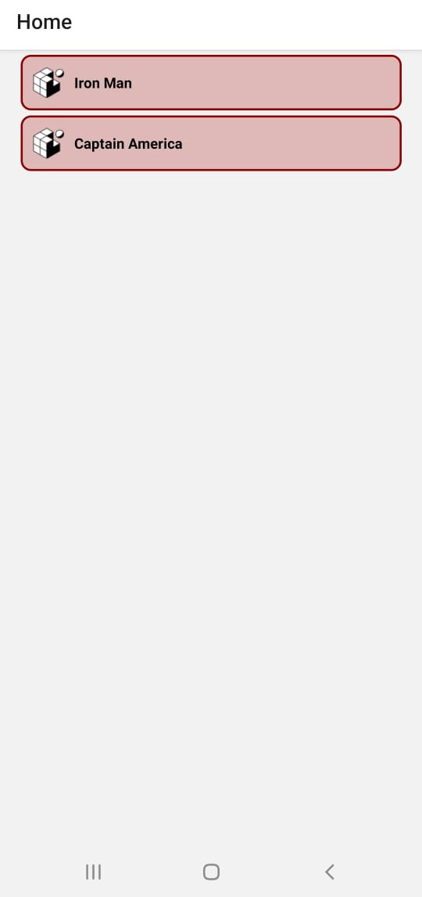

# Henry Workshop - React Native

## Overview

En este workshop vamos a crear una aplicación mobile utilizando React Native, para ello usaremos Expo para generar el boilerplate inicial y sobre el modificar lo necesario para elaborar la aplicación que se describirá a continuación.

## Setup Inicial

```bash
  // Instalamos expo-cli
  npm install -g expo-cli

  // Inicializamos un proyecto en este caso llamado MarvelApp
  expo init MarvelApp

  // Podemos ya probar su funcionamiento
  cd MarvelApp
  npm start
```

## Objetivo

La idea del workshop es crear una aplicación sobre Marvel en la cual se incluyan por lo menos las siguientes funcionalidades:

 - Poder mostrar un listado de todos los personajes de Marvel (Incluyendo nombre y foto)
 - Poder filtrar el listado de personajes a partir de un input que ingrese el usuario y devuelva solo los personajes que comiencen con dicha palabra
 - Poder ir al detalle del personaje donde se deben poder seleccionar dos subpantallas:
    * Ver nuevamente el nombre y su foto pero también agregando la descripción 
    * Ver un listado de comics en los cuales aparece dicho personaje
- __EXTRA__: Poder agregar/quitar personajes a una lista de favoritos

## Imagenes ilustrativas de ejemplo

TODO

## Configuración API

Para poder obtener los resultados de los request a la API de Marvel vamos a necesitar contar con una API Key que la obtendremos creando una cuenta en https://developer.marvel.com/ y luego yendo a la sección "Get a Key", allí encontraran tanto una clave pública como una privada (Ambas serán necesarias).

La URL del request se formará de la siguiente forma:

http://gateway.marvel.com/v1/public/characters?ts={ts}&apikey={publicKey}&hash={md5Hash}

Donde:
 * ts: es un timestamp en el cual pueden ingresar cualquier valor, por ejemplo `henry`
 * publicKey: es la clave pública que les figura en la sección que recién mencionamos arriba
 * md5Hash: es un hash utilizando md5 y pasandole como inputs ts, privateKey y publicKey

Como siempre estos datos son sensibles por lo que lo recuerden no subirlos a su repositorio de código. Para evitar esto tienen instalado como dependencia dentro del proyecto el módulo `react-native-dotenv`. Adicionlamente ya se encuentra configurado en el archivo `babel.config.js` dentro de `plugins`:

```js
module.exports = function(api) {
  api.cache(true);
  return {
    presets: ['babel-preset-expo'],
    plugins: [
      ["module:react-native-dotenv", {
        "moduleName": "@env",
        "path": ".env",
        "blacklist": null,
        "whitelist": null,
        "safe": false,
        "allowUndefined": true
      }]
    ]
  };
};
```

Esto les va a permitir utilizar cualquier variable definida dentro de un archivo `.env` que debe estar definido al mismo nivel del archivo de configuración de babel. En nuestro caso ustedes deberían definir las siguientes propiedades:

```
publicKey=...
privateKey=...
```

Luego podrán utilizarlas desde cualquier archivo del proyecto importándolas de la siguiente forma:

```js
import { publicKey, privateKey } from '@env';
```

A continuación les daremos una guía de como ir realizando la aplicación pero no es necesaria que la sigan tal cual se detalla o si prefieren hacer todo por su cuenta sin siquiera leerlo también es viable.

## Configuración de Screens

Comenzaremos pensando que pantallas vamos a tener para ya dejarlas configuradas y luego trabajar sobre cada una de ellas para implementar la parte visual de cada una. Basándonos en las imagenes ilustrativas brindadas más arriba nececsitaríamos las siguientes pantallas:

 * __Home__: contendrá la barra de búsqueda y el listado de personajes
 * __Detail__: cuando el usuario seleccione un personaje se deberá ingresar a esta pantalla con unos tabs inferiores para ir a switcheando entre `Perfil` y `Comcis`. Inicialmente se mostrará la primera.
 * __Perfil__: contendrá la información detallada del personaje seleccionado
 * __Comics__: contendrá un listado de comics en los cuales participa dicho personaje

*__Nota__: ya se encuentran instaladas las dependencias para la utilización tanto del Stack Navigator como del Tab Navigator, en el caso de que no utilicen este boilerplate recordan que deben instalarlos al igual que los módulos generales para React Navigation*

 ### Home Screen

Como vamos a querer que a partir del click en algun personaje listado en esta pantalla nos lleve a otra vamos a utilizar un Stack Navigator:

```js
import * as React from 'react';
import { NavigationContainer } from '@react-navigation/native';
import { createStackNavigator } from '@react-navigation/stack';
import Home from './components/Home'

const Stack = createStackNavigator();

export default function App() {
  return (
    <NavigationContainer>
      <Stack.Navigator>
        <Stack.Screen name="Home" component={Home} />
      </Stack.Navigator>
    </NavigationContainer>
  );
}
```

Adicionalmente definiremos una carpeta `components` para ir guardando allí los componentes de React que vayamos a utilizar. En este caso necesitaremos definir el componente `Home` para utilizarlo dentro del Stack Navigator. Por ahora no nos vamos a preocupar por estilos.

### Componente Home

```js
import * as React from 'react';
import { Text, View } from 'react-native';

export default function Home() {
  return (
    <View style={{ flex: 1, alignItems: 'center', justifyContent: 'center' }}>
      <Text>Home Screen</Text>
    </View>
  );
}
```

### Componente CharacterCard

Por otro lado tenemos que tener algún componente que se relacione con cada uno de los personajes a mostrar en el listado dentro de `Home`. Debe ser un componente presentacional que muestre una imagen y un nombre, por lo que recibirá ambos datos por props y simplemente se encargará de darle estilos a los mismos (Los estilos quedan libres a su gusto):

```js
import * as React from 'react';
import { Text, View,  Image } from 'react-native';

export default function CharacterCard({image, name}) {
  return (
    <View style={styles.container}>
			<Image 
				style={styles.image}
				source={image}
			/>
      <Text style={styles.font}>{name}</Text>
    </View>
  );
}
```

Para probar si esta funcionando correctamente agregaremos dos `CharacterCard` desde el componente `Home`, luego esto será reemplazado cuando tengamos la llamada a la API con los datos reales.

```js
import * as React from 'react';
import { View } from 'react-native';
import CharacterCard from './CharacterCard';

export default function Home() {
  return (
    <View>
      <CharacterCard image={require('../assets/favicon.png')} name='Iron Man' />
      <CharacterCard image={require('../assets/favicon.png')} name='Captain America' />
    </View>
  );
}
```

<p align="center">
  
</p>

Ahora quisieramos que cuando se haga click en alguno de los personajes nos rediriga a la pantalla de `Detail` para eso tenemos que hacer uso del método `navigate` de la prop `navigation` que reciben todos los componentes.

El inconveniente que tenemos ahora es que `CharacterCard` no recibe de forma automática el objeto `navigation` como si lo hace `Home`. Por lo que tenemos dos posibles soluciones:

  1. Le pasamos la prop a `CharacterCard` desde `Home`
  2. Utilizamos el hook `useNavigation` en el componente `CharacterCard` para darle acceso al objeto `navigation`

Adicionalmente, el componente nativo `View` no dispone de un event listener `onPress` para detectar los touches por lo que vamos a cambiarlo por alguno de los Touchables que vimos antes (En particular en nuestra guia de ejemplo utilizaremos el `TouchableOpacity`).

```js
export default function Home() {
  return (
    <View>
      {/* Opcion 1 */}
      <CharacterCard {...props} image={require('../assets/favicon.png')} name='Iron Man' />
      <CharacterCard {...props} image={require('../assets/favicon.png')} name='Captain America' />

      {/* Opcion 2 */}
      <CharacterCard image={require('../assets/favicon.png')} name='Iron Man' />
      <CharacterCard image={require('../assets/favicon.png')} name='Captain America' />
    </View>
  );
}
```

```js
// Opcion 1
export default function CharacterCard({image, name, navigation}) {
  return (
    <TouchableOpacity 
			style={styles.container}
			onPress={() => navigation.navigate('Detail')}
	>
			<Image 
				style={styles.image}
				source={image}
			/>
      <Text style={styles.font}>{name}</Text>
    </TouchableOpacity>
  );
}

// Opcion 2
import { useNavigation } from '@react-navigation/native';

export default function CharacterCard({image, name}) {
	const navigation = useNavigation();
  return (
    <TouchableOpacity 
			style={styles.container}
			onPress={() => navigation.navigate('Detail')}
	>
			<Image 
				style={styles.image}
				source={image}
			/>
      <Text style={styles.font}>{name}</Text>
    </TouchableOpacity>
  );
}
```

### Detail Screen

Ahora nos falta crear la screen para los detalles del personaje ya que sino al hacer click no redirigirá a ninguna parte ya que no encontrará ninguna pantatlla que matchee con 'Detail'.

```js
import Detail from './components/Detail';

export default function App() {
  return (
    <NavigationContainer>
      <Stack.Navigator>
        <Stack.Screen name="Home" component={Home} />
        <Stack.Screen name="Detail" component={Detail} />
      </Stack.Navigator>
    </NavigationContainer>
  );
}
```

Y obviamente tenes que crear nuestro componente `Detatils` que queremos que sea a su vez un nested navigator ya que queremos tener dos tabs en la parte inferior de este pantalla para poder switchear entre `Information` y `Comics`.
